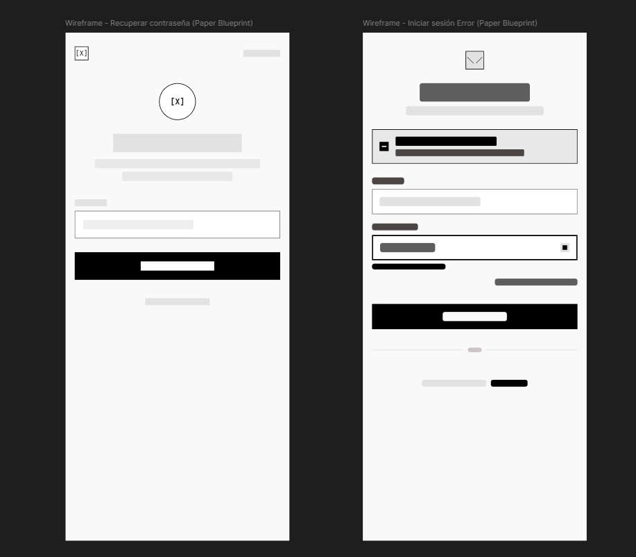
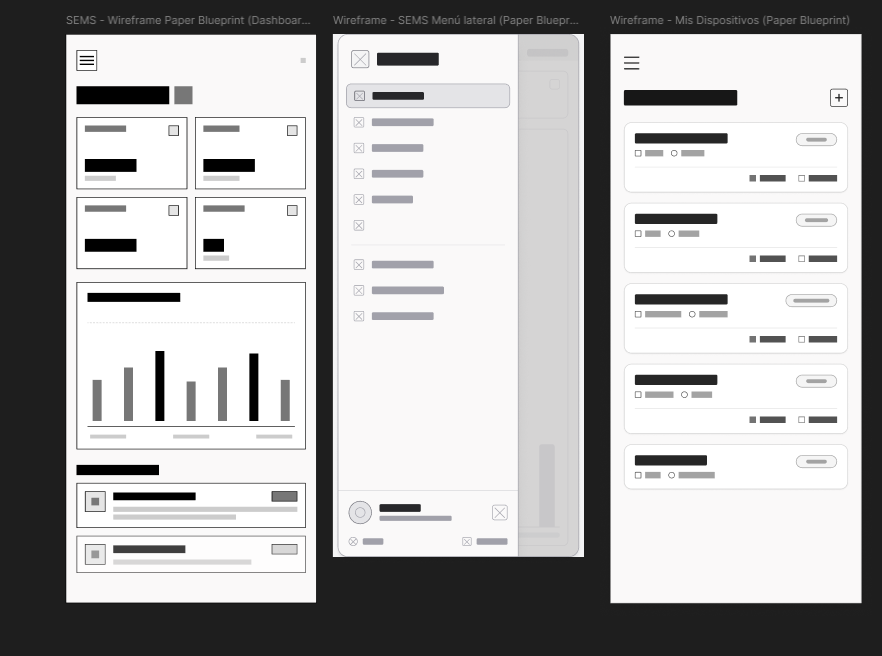
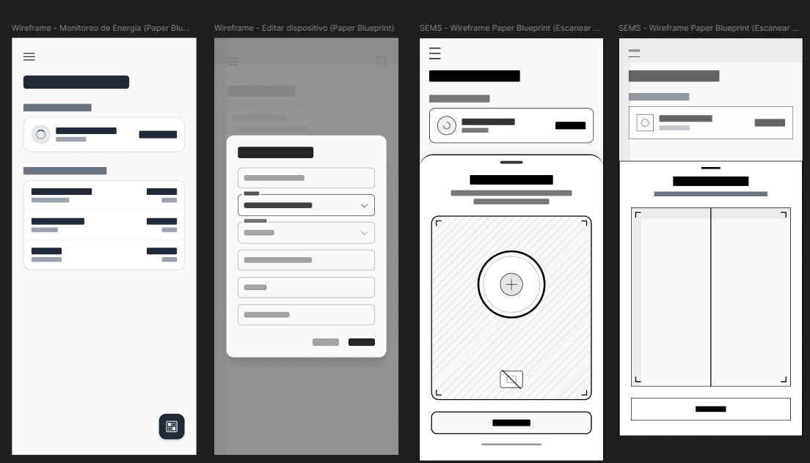
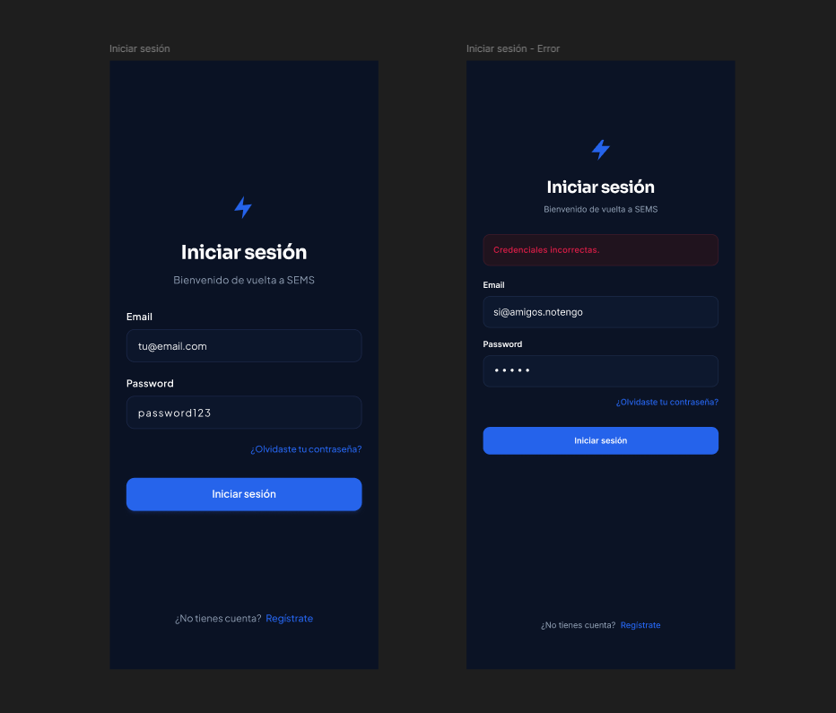
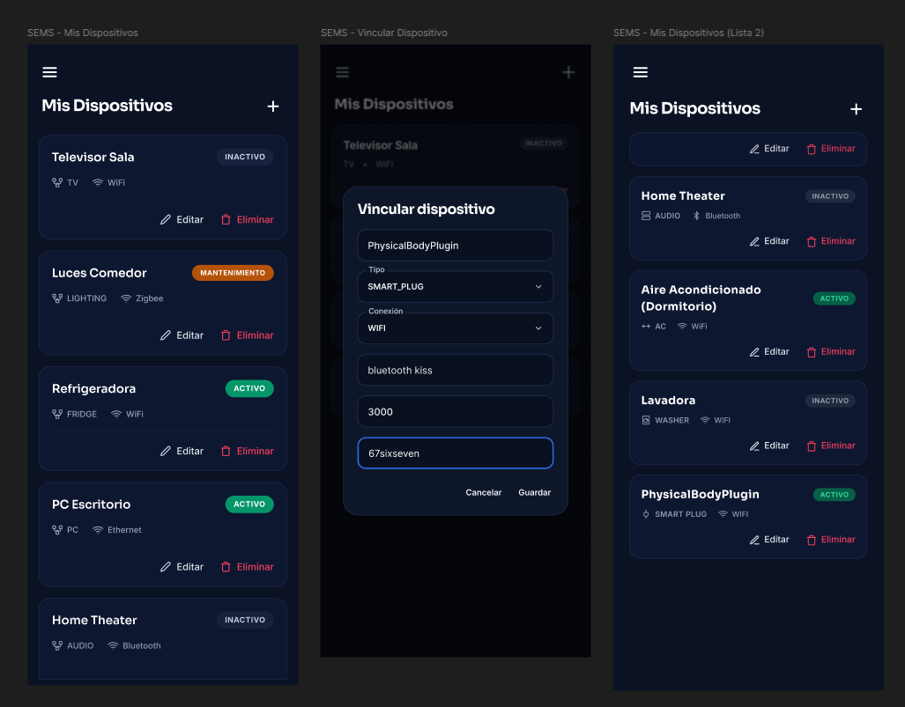
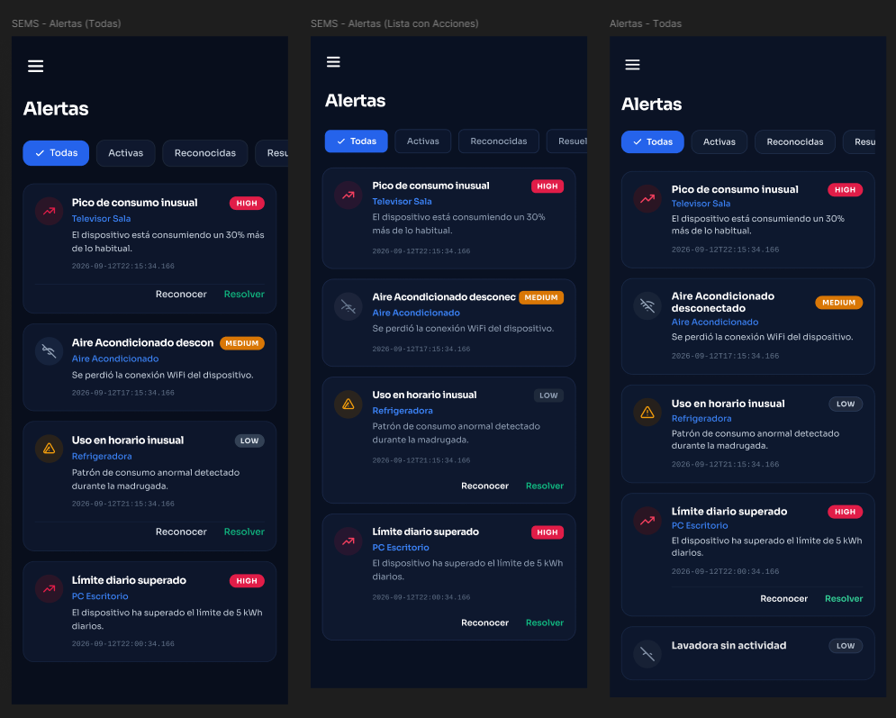

[⬅ Volver al índice](../README.md)

# Capítulo IV: Product Design

Este capítulo recoge las decisiones de diseño del producto: el lenguaje visual común a los tres
artefactos de la solución, la arquitectura de la información, el diseño de interfaz del *Landing
Page* y de la aplicación web, la arquitectura de software y el diseño de datos.

## 4.1. Style Guidelines

### 4.1.1. General Style Guidelines

El lenguaje de diseño de toda la solución es **Material Design 3**. La decisión no es estética:
el enunciado del curso lo fija como restricción, y adoptarlo permite que el *Landing Page* y la
aplicación web compartan una misma gramática visual sin tener que mantener dos sistemas.

**Branding.** *Energix* es la startup; **SEMS** es el producto. En los artefactos digitales el
nombre visible es SEMS, y Energix aparece como responsable en el pie de página y en la sección
legal. La marca se apoya en un símbolo de rayo sobre un cuadrado de esquinas redondeadas, que
funciona a 32 px como favicon y a 36 px en la barra superior.

**Paleta.** Se usan los *color roles* de Material Design 3 en lugar de colores sueltos. Cada rol
tiene su pareja de contraste (`on-*`), lo que garantiza que ningún texto quede por debajo del
mínimo legible.

| Rol | Claro | Oscuro | Uso |
| :-- | :-- | :-- | :-- |
| `primary` | `#0b57d0` | `#adc6ff` | Acciones principales, enlaces, énfasis |
| `on-primary` | `#ffffff` | `#002e69` | Texto sobre `primary` |
| `primary-container` | `#d9e2ff` | `#00458f` | Fondos de realce, etiquetas |
| `tertiary` | `#146c2e` | `#a8d2b3` | Ahorro conseguido, estados favorables |
| `error` | `#b3261e` | `#f2b8b5` | Alerta de demanda, exceso de potencia |
| `surface` | `#fdfcff` | `#111318` | Fondo de página |
| `on-surface` | `#1a1c1e` | `#e2e2e6` | Texto principal |
| `on-surface-variant` | `#43474e` | `#c3c7cf` | Texto secundario |
| `outline-variant` | `#c3c7cf` | `#43474e` | Bordes y separadores |

El verde de `tertiary` se reserva para el ahorro y el rojo de `error` para la demanda por encima
de lo contratado. Esa asociación es constante en los tres artefactos: un número verde siempre
significa dinero que no se gastó, y un bloque rojo siempre significa un cargo que se va a aplicar.

**Tipografía.** *Roboto*, la familia tipográfica de Material Design, con la escala de tipos del
sistema. Se define una pila de reserva (`"Segoe UI", system-ui, -apple-system, sans-serif`) para
que la página siga siendo legible si la fuente remota no carga.

| Estilo | Tamaño | Peso | Uso |
| :-- | :-- | :-- | :-- |
| Display | `clamp(2.25rem, 1.4rem + 3.2vw, 3.5rem)` | 700 | Titular del *hero* |
| Headline | `clamp(1.75rem, 1.2rem + 2vw, 2.5rem)` | 700 | Títulos de sección |
| Title | 1.25 rem | 600 | Títulos de tarjeta |
| Body | 1 rem / 1.55 | 400 | Texto corrido |
| Label | 0.8125 rem | 600 | Etiquetas y *kickers* |

**Espaciado y forma.** Rejilla de 4 px. La escala de formas sigue la de Material Design: 4 px para
elementos pequeños, 12–16 px para tarjetas, 28 px para contenedores grandes y radio completo para
botones y *chips*.

**Movimiento.** Curva estándar `cubic-bezier(0.2, 0, 0, 1)` con duraciones de 150 ms (corta),
300 ms (media) y 500 ms (larga). Toda animación se desactiva bajo `prefers-reduced-motion`.

**Tono de voz.** Segunda persona, frases cortas y cifras concretas en soles. Se evita el
vocabulario técnico de ingeniería eléctrica en la interfaz de cara al cliente: se habla de
«consumo», «pico» y «potencia contratada», no de «factor de carga» ni de «demanda coincidente».

### 4.1.2. Web Style Guidelines

**Landing Page.** Implementado con HTML5, CSS3 y JavaScript sin framework. Los *color roles* y la
escala tipográfica se declaran como propiedades personalizadas de CSS sobre `:root`; el esquema
oscuro solo redefine esos tokens, de modo que no existe una segunda hoja de estilos que mantener.

Componentes de Material Design utilizados: botón relleno (*filled*), botón con contorno
(*outlined*), botón tonal, botón de icono, tarjeta con elevación, *chip* de asistencia y lista.
Los botones aplican el patrón de *state layer*: una capa translúcida del color actual al 8 % en
*hover* y al 12 % en foco y pulsación, en lugar de un cambio de color.

**Aplicación web.** Vue 3 con **PrimeVue** y su *preset* Material, tal como exige el enunciado
para el caso de Vue. La correspondencia entre ambos artefactos es directa: PrimeVue implementa los
mismos componentes de Material Design que el *Landing Page* construye a mano, por lo que un botón
principal se ve igual en los dos sitios.

| Elemento | Landing Page | Aplicación web |
| :-- | :-- | :-- |
| Botón principal | `.btn.btn-filled` | `<Button>` (*filled*) |
| Botón secundario | `.btn.btn-outlined` | `<Button outlined>` |
| Tarjeta | `.card` | `<Card>` |
| Tabla | `<table>` con estilos propios | `<DataTable>` |
| Aviso | `.mock-alert` | `<Message severity="error">` |

**Modo claro y oscuro.** Ambos artefactos ofrecen los dos temas. La preferencia se guarda en
`localStorage` y se aplica antes del primer pintado para evitar el parpadeo. Si no hay preferencia
guardada, se respeta `prefers-color-scheme`.

**Accesibilidad.** Se aplica **WCAG 2.1 nivel AA**:

- Contraste mínimo de 4.5:1 en texto normal, verificado en los dos temas.
- Objetivos táctiles de 48 × 48 px.
- Anillo de foco visible en todo elemento interactivo.
- Enlace de salto al contenido como primer elemento enfocable.
- Puntos de referencia semánticos (`header`, `nav`, `main`, `footer`) y un solo `h1` por página.
- Atributos ARIA en controles sin texto visible, en el acordeón de preguntas frecuentes
  (`aria-expanded` / `aria-controls`) y en el conmutador de tema (`aria-pressed`).

### 4.1.3. Mobile Style Guidelines

> Esta sección se completa cuando exista la aplicación nativa. La paleta, la tipografía y la
> escala de espaciado definidas en 4.1.1 son las que se trasladarán a ambas plataformas.

#### 4.1.3.1. iOS Mobile Style Guidelines

> `<Style guidelines para iOS.>`

#### 4.1.3.2. Android Mobile Style Guidelines

> `<Style guidelines para Android.>`

## 4.2. Information Architecture

### 4.2.1. Organization Systems

La solución organiza su contenido con tres esquemas distintos, cada uno donde corresponde:

| Esquema | Dónde se aplica | Ejemplo |
| :-- | :-- | :-- |
| **Secuencial** | *Landing Page* | El visitante recorre problema → funcionamiento → características → segmentos → planes → preguntas, en un orden pensado para construir el argumento |
| **Jerárquico** | Aplicación web | Organización → locales → zonas → medidores. Refleja la estructura real del cliente |
| **Matricial** | Analítica y reportes | El mismo consumo se puede ver por local, por zona, por periodo o por franja horaria |

La jerarquía de la aplicación web no es una decisión de interfaz sino del dominio: un medidor
pertenece a un local y opcionalmente a una zona, y esa relación es obligatoria en la API.

### 4.2.2. Labeling Systems

Las etiquetas visibles se toman del *Ubiquitous Language* de la sección 2.4, con su denominación
en inglés como forma canónica y su equivalente en español latinoamericano.

| Concepto | Etiqueta (en-US) | Etiqueta (es-419) | Nunca se usa |
| :-- | :-- | :-- | :-- |
| `Organization` | Organization | Organización | Empresa, cuenta |
| `Site` | Site | Local | Sucursal, tienda, hogar |
| `Zone` | Zone | Zona | Área, sección |
| `Meter` | Meter | Medidor | Sensor, dispositivo |
| `Peak hours` | Peak hours | Hora punta | Horario caro |
| `Contracted power` | Contracted power | Potencia contratada | Límite |
| `Maximum demand` | Maximum demand | Demanda máxima | Pico |
| `Power charge` | Power charge | Cargo por potencia | Cargo fijo |

La columna «nunca se usa» existe porque el producto viene de un segmento anterior de viviendas:
«hogar» y «sensor» son términos heredados que ya no corresponden al dominio comercial.

### 4.2.3. SEO Tags and Meta Tags

Etiquetas del *Landing Page*, en inglés por ser el idioma por defecto de la solución, con la
alternativa en español declarada:

| Etiqueta | Valor |
| :-- | :-- |
| `<title>` | SEMS — Stop paying for demand peaks you never saw |
| `<meta name="description">` | SEMS measures the electricity of supermarkets, stores and retail chains in real time, breaks consumption down by site and zone, and warns you before a demand peak raises your bill. A product by Energix. |
| `<html lang>` | `en-US`, conmutable a `es-419` |
| `og:type` | `website` |
| `og:title` | SEMS — Smart Energy Management System |
| `og:description` | Real-time electricity monitoring for commercial establishments in Peru. |
| `og:locale` | `en_US`, con `og:locale:alternate` = `es_419` |
| `twitter:card` | `summary_large_image` |
| `theme-color` | `#fdfcff` en claro y `#111318` en oscuro |

El título y la descripción también se traducen al cambiar de idioma, no solo el cuerpo de la
página: ambos llevan la marca `data-i18n` y el guion los sustituye junto al resto del contenido.

### 4.2.4. Searching Systems

El *Landing Page* no incorpora buscador: es una página única y la navegación por anclas cubre el
recorrido completo.

En la aplicación web la búsqueda es **filtrado dentro de cada vista**, no un buscador global:

| Vista | Filtro | Criterio |
| :-- | :-- | :-- |
| Dispositivos | Por local, por zona y por estado | Los dispositivos dados de baja no aparecen |
| Alertas | Por severidad y por estado de lectura | Las no leídas primero |
| Lecturas | Por rango de fechas y por dispositivo | Orden descendente por fecha |
| Analítica | Por periodo y por local | Comparación entre locales |

### 4.2.5. Navigation Systems

**Landing Page.** Barra superior fija con las cinco secciones y el llamado a la acción. En
pantallas menores de 860 px la barra se colapsa en un botón que despliega el menú, con
`aria-expanded` reflejando el estado. Los enlaces del pie repiten la navegación y añaden la
sección legal.

**Aplicación web.** Barra lateral persistente con las nueve vistas del producto, más una barra
superior con el título de la vista activa, el conmutador de idioma y el menú de la cuenta.

| Ruta | Vista | Acceso |
| :-- | :-- | :-- |
| `/login`, `/register` | Autenticación | Pública |
| `/forgot-password`, `/reset-password`, `/verify` | Recuperación y verificación | Pública |
| `/` | Resumen | Autenticada |
| `/devices` | Dispositivos | Autenticada |
| `/monitoring` | Monitoreo | Autenticada |
| `/analytics` | Analítica | Autenticada |
| `/alerts` | Alertas | Autenticada |
| `/reports` | Reportes | Autenticada |
| `/subscription` | Suscripción y pagos | Autenticada |
| `/settings` | Configuración | Autenticada |
| `/:pathMatch(.*)*` | No encontrado | Pública |

Un guardián de ruta comprueba la sesión antes de cada navegación y redirige a `/login` cuando no
hay token válido.

> **Deuda identificada.** La aplicación web conserva una vista `/household` («Mi hogar») heredada
> del segmento anterior de viviendas. No corresponde al dominio comercial y debe sustituirse por
> una vista de organización y locales. Queda registrada como deuda técnica en el capítulo V.

## 4.3. Landing Page UI Design

### 4.3.1. Landing Page Wireframe

> `<Insertar los wireframes del Landing Page para Desktop Web Browser y Mobile Web Browser,
> elaborados en Figma o LucidChart.>`

Estructura de bloques, de arriba abajo:

1. Barra superior con marca, navegación, idioma, tema y llamado a la acción.
2. *Hero* a dos columnas: propuesta de valor a la izquierda, vista previa del panel a la derecha.
3. Franja de cuatro cifras con su fuente citada.
4. Problema, en tres tarjetas.
5. Funcionamiento, en cuatro pasos numerados.
6. Características, en seis tarjetas.
7. Segmentos objetivo, en dos tarjetas con llamado a la acción propio.
8. Planes, en tres columnas con el plan intermedio destacado.
9. Preguntas frecuentes, en acordeón.
10. Llamado a la acción final.
11. Pie con navegación, enlaces legales y datos de contacto.

En navegador móvil las columnas colapsan a una sola y la navegación pasa al menú desplegable.

### 4.3.2. Landing Page Mock-up

> `<Insertar los mock-ups del Landing Page en sus versiones de escritorio y móvil.>`

## 4.4. Mobile Applications UX/UI Design

En esta sección se presenta la propuesta de diseño UX/UI de la aplicación móvil de SEMS, describiendo la estructura visual, los elementos de interfaz y los patrones de interacción que orientan la experiencia del usuario tanto para coordinadores de cadenas como para propietarios independientes.

El diseño está enfocado en facilitar el monitoreo de energía y la gestión de alertas, priorizando una interacción clara, rápida y consistente. Asimismo, se mantiene la coherencia con los Style Guidelines y la Information Architecture establecidos.

### 4.4.1. Mobile Applications Wireframes

En esta sección se presentan los wireframes de fidelidad media para la aplicación móvil de SEMS, diseñada específicamente para los roles de Administrador de cadena (Segmento 1) y Propietario independiente (Segmento 2). La propuesta visual y funcional responde directamente a estándares de usabilidad móvil, estructuración de datos y accesibilidad.

   
  Nota: Wireframe de Inicio de Sesión

   
  Nota: Wireframe de Recuperación y Registro

   
  Nota: Wireframe del Dashboard y Mis Dispositivos

   
  Nota: Wireframe de Monitoreo y Escaneo de Medidores

   
  Nota: Wireframe de Analíticas y Recomendaciones

   
  Nota: Wireframe de Reportes, Suscripción y Organización

   
  Nota: Wireframe de Configuración y Perfil

   
  Nota: Wireframe de detalle de consumos

   
  Nota: Wireframe de menús modales

### 4.4.2. Mobile Applications Wireflow Diagrams

**Segmento 1: Responsable de Operaciones de Cadena**

* User Goal: Como coordinador de cadena, quiero registrar un nuevo medidor inteligente escaneándolo con la cámara, para asignar en qué área del local está instalado y comenzar a monitorearlo.

Task Flow:

 
<...espacio para el task flow...>
  Nota: Diagrama de Task Flow para vincular nuevos medidores 

Wireflow:

 
 
  Nota: Diagrama de Wireflow para el registro de nuevos dispositivos 

Descripción del flujo:
El usuario ingresa a la sección de "Mis Dispositivos" desde el menú lateral, selecciona la opción para agregar un nuevo equipo ("Vincular Dispositivo") y utiliza la cámara para escanear el código QR del medidor inteligente. Una vez detectado, asigna el tipo de dispositivo y la zona. Al confirmar, el dispositivo queda activo y vinculado a su red para comenzar la transmisión de datos.

* User Goal: Como coordinador de cadena, quiero atender una alerta de exceso de consumo en hora punta, para reconocerla a tiempo y evitar cargos extras en la facturación eléctrica.

Task Flow:

 
<...espacio para el task flow...>
  Nota: Diagrama de Task Flow para atención de alertas de consumo 

Wireflow:

 
 
  Nota: Diagrama de Wireflow de resolución de alertas 

Descripción del flujo:
Desde el dashboard, el usuario visualiza notificaciones pendientes y navega a la vista de "Alertas". Allí filtra las activas, selecciona una alerta crítica de sobreconsumo (Cargo por Potencia), lee los detalles del incidente y presiona "Reconocer". Posteriormente, tras coordinar la reducción de carga, marca la alerta como "Resuelta", manteniendo un historial limpio.

* User Goal: Como coordinador de cadena, quiero configurar el costo por kWh y la meta global de consumo, para que el sistema me notifique si estoy por exceder el presupuesto del mes.

Task Flow:

 
<...espacio para el task flow...>
  Nota: Diagrama de Task Flow para configuración de tarifas y metas 

Wireflow:

 
 
  Nota: Diagrama de Wireflow de actualización de metas y tarifas 

Descripción del flujo:
El usuario ingresa a "Mi Organización", donde visualiza los parámetros actuales de la sede. Modifica el campo de "Meta global (kWh/mes)" y luego actualiza el "Costo por kWh" en la sección de tarifa energética. Guarda ambos valores, los cuales recalcularán inmediatamente las proyecciones y costos estimados en todo el sistema.

* User Goal: Como coordinador de cadena, quiero generar un reporte energético mensual descargable, para presentarlo a gerencia y justificar los gastos de electricidad.

Task Flow:

 
<...espacio para el task flow...>
  Nota: Diagrama de Task Flow para generación de reportes 

Wireflow:

 
 
  Nota: Diagrama de Wireflow de exportación de reportes PDF 

Descripción del flujo:
El usuario se dirige a la sección de "Reportes PDF". Selecciona el rango de tiempo deseado (por ejemplo, "Mes Pasado") a través del menú desplegable y presiona "Descargar PDF". El sistema procesa la información de todos los dispositivos y genera un documento con las métricas consolidadas, listo para ser guardado o compartido.

**Segmento 2: Propietario de Establecimiento Independiente**

* User Goal: Como dueño de local, quiero iniciar sesión de forma segura y poder recuperar mi cuenta si olvido la contraseña, para no perder el acceso a los datos de mi negocio.

Task Flow:

 
<...espacio para el task flow...>
  Nota: Diagrama de Task Flow de inicio de sesión y recuperación 

Wireflow:

 
 
  Nota: Diagrama de Wireflow de autenticación de usuario 

Descripción del flujo:
El propietario abre la app e intenta iniciar sesión, pero al fallar las credenciales selecciona "¿Olvidaste tu contraseña?". Ingresa su correo electrónico y el sistema le envía un enlace de recuperación. Tras restablecer sus credenciales, accede exitosamente al Dashboard.

* User Goal: Como dueño de local, quiero revisar el resumen rápido de mi consumo actual, para saber de un vistazo cuánto he gastado hasta el momento en el mes.

Task Flow:

 
<...espacio para el task flow...>
  Nota: Diagrama de Task Flow de revisión de consumo diario 

Wireflow:

 
 
  Nota: Diagrama de Wireflow de consulta rápida de resumen 

Descripción del flujo:
Al iniciar sesión, el usuario aterriza directamente en el Dashboard Principal. Allí visualiza su consumo actual en soles (S/) y kilovatios-hora (kWh), además de un gráfico de barras con la tendencia de los últimos 14 días. Para más detalle, entra a "Monitoreo de Energía" donde ve un desglose simplificado por dispositivo activo.

* User Goal: Como dueño de local, quiero aplicar sugerencias automáticas de la IA, para reducir mi factura de luz sin tener que analizar gráficos complejos.

Task Flow:

 
<...espacio para el task flow...>
  Nota: Diagrama de Task Flow para aplicación de recomendaciones de ahorro 

Wireflow:

 
 
  Nota: Diagrama de Wireflow de implementación de sugerencias de IA 

Descripción del flujo:
El usuario ingresa a "Analíticas" y revisa la sección "Recomendaciones de IA". Identifica una sugerencia útil (ej. "Apaga el Aire Acondicionado a las 3 AM" que promete un ahorro de S/ 35.50). Selecciona aplicar recomendación, y la IA ajusta automáticamente el cronograma del enchufe inteligente. El estado de la recomendación cambia a "Aplicada", reflejando un impacto positivo en la proyección de su factura mensual.

### 4.4.3. Mobile Applications Mock-ups

Esta sección reúne la interfaz gráfica de alta fidelidad para la aplicación móvil de SEMS, diseñada para ofrecer una experiencia fluida e intuitiva tanto para los administradores corporativos como para los dueños de locales independientes. El diseño aplica la identidad visual completa del proyecto: modo oscuro predeterminado por eficiencia energética (OLED), paleta con acentos azules, e indicadores claros en verde/rojo para estados financieros y de alerta.

   
  Nota: Mockup de Inicio de Sesión

   
  Nota: Mockup de Recuperación y Registro

   
  Nota: Mockup del Dashboard y Mis Dispositivos

   
  Nota: Mockup de Monitoreo y Escaneo de Medidores

   
  Nota: Mockup de Analíticas y Recomendaciones

   
  Nota: Mockup de Reportes, Suscripción y Organización

   
  Nota: Mockup de Configuración y Perfil

   
  Nota: Mockup de detalle de consumos

   
  Nota: Mockup de menús modales

### 4.4.4. Mobile Applications User Flow Diagrams

**Segmento 1: Responsable de Operaciones de Cadena**

* User Goal: Como coordinador de cadena, quiero registrar un nuevo medidor inteligente escaneándolo con la cámara, para asignar en qué área del local está instalado y comenzar a monitorearlo.

User Flow:

 
 
  Nota: Diagrama de User Flow para el registro de nuevos dispositivos en alta fidelidad 

* User Goal: Como coordinador de cadena, quiero atender una alerta de exceso de consumo en hora punta, para reconocerla a tiempo y evitar cargos extras en la facturación eléctrica.

User Flow:

 
 
  Nota: Diagrama de User Flow de resolución de alertas en alta fidelidad 

* User Goal: Como coordinador de cadena, quiero configurar el costo por kWh y la meta global de consumo, para que el sistema me notifique si estoy por exceder el presupuesto del mes.

User Flow:

 
 
  Nota: Diagrama de User Flow de actualización de metas y tarifas en alta fidelidad 

* User Goal: Como coordinador de cadena, quiero generar un reporte energético mensual descargable, para presentarlo a gerencia y justificar los gastos de electricidad.

User Flow:

 
 
  Nota: Diagrama de User Flow de exportación de reportes PDF en alta fidelidad 

**Segmento 2: Propietario de Establecimiento Independiente**

* User Goal: Como dueño de local, quiero iniciar sesión de forma segura y poder recuperar mi cuenta si olvido la contraseña, para no perder el acceso a los datos de mi negocio.

User Flow:

 
 
  Nota: Diagrama de User Flow de autenticación de usuario en alta fidelidad 

* User Goal: Como dueño de local, quiero revisar el resumen rápido de mi consumo actual, para saber de un vistazo cuánto he gastado hasta el momento en el mes.

User Flow:

 
 
  Nota: Diagrama de User Flow de consulta rápida de resumen en alta fidelidad 

* User Goal: Como dueño de local, quiero aplicar sugerencias automáticas de la IA, para reducir mi factura de luz sin tener que analizar gráficos complejos.

User Flow:

 
 
  Nota: Diagrama de User Flow de implementación de sugerencias de IA en alta fidelidad 

## 4.5. Mobile Applications Prototyping

### 4.5.1. Android Mobile Applications Prototyping

> `<Enlace al prototipo de Android.>`

### 4.5.2. iOS Mobile Applications Prototyping

> `<Enlace al prototipo de iOS.>`

## 4.6. Web Applications UX/UI Design

### 4.6.1. Web Applications Wireframes

> `<Insertar los wireframes de la aplicación web.>`

Distribución común a todas las vistas autenticadas: barra lateral fija a la izquierda con la
navegación, barra superior con el título de la vista y los controles de cuenta, y área de
contenido con una rejilla de tarjetas.

### 4.6.2. Web Applications Wireflow Diagrams

> `<Insertar los wireflow diagrams de la aplicación web.>`

Flujos que deben representarse:

- Registro → verificación de correo → primer inicio de sesión → alta de organización.
- Alta de local → definición de zonas → registro de medidores.
- Recepción de alerta de demanda → consulta del detalle → acción sobre la zona responsable.
- Consulta de planes → sesión de pago → confirmación de la suscripción.

### 4.6.3. Web Applications Mock-ups

> `<Insertar los mock-ups de la aplicación web.>`

### 4.6.4. Web Applications User Flow Diagrams

> `<Insertar los user flow diagrams de la aplicación web.>`

## 4.7. Web Applications Prototyping

> `<Enlace al prototipo navegable de la aplicación web.>`

## 4.8. Domain-Driven Software Architecture

La arquitectura se representa con el **C4 Model**. El *backend* es un **monolito modular**: un
único proceso desplegable con ocho módulos, cada uno con su propio modelo de dominio y sus tablas
prefijadas, comunicándose entre sí por puertos explícitos y por eventos de dominio.

### 4.8.1. Software Architecture Context Diagram

> `<Insertar el diagrama de contexto C4 elaborado en Structurizr.>`

| Elemento | Tipo | Descripción |
| :-- | :-- | :-- |
| Administrador de organización | Persona | Gestiona la cadena, los locales y los permisos |
| Supervisor de local | Persona | Opera un local concreto |
| Operario | Persona | Consulta el estado de los equipos de su local |
| **SEMS** | Sistema | Mide, analiza y alerta sobre el consumo eléctrico comercial |
| Pasarela de pagos | Sistema externo | Procesa cobros y devuelve eventos de confirmación |
| Proveedor de correo | Sistema externo | Entrega verificaciones, recuperaciones y alertas |
| Proveedor de tarifas | Sistema externo | Suministra el precio vigente de la energía |

### 4.8.2. Software Architecture Container Diagrams

> `<Insertar el diagrama de contenedores C4.>`

| Contenedor | Tecnología | Responsabilidad |
| :-- | :-- | :-- |
| Landing Page | HTML5, CSS3, JavaScript | Presentar la propuesta de valor y dirigir al registro |
| Aplicación web | Vue 3, PrimeVue, Vite | Interfaz de operación del producto |
| API REST | ASP.NET Core 8, C# | Lógica de negocio y persistencia |
| Base de datos | PostgreSQL | Almacén único con tablas prefijadas por módulo |

### 4.8.3. Software Architecture Components Diagrams

> `<Insertar los diagramas de componentes C4 de los módulos principales.>`

Los ocho módulos del monolito y su prefijo de tablas:

| Módulo | Prefijo | Responsabilidad |
| :-- | :-- | :-- |
| Identity & Access Management | `iam_` | Cuentas, autenticación, papeles y tokens |
| Organizations | `og_` | Organizaciones, locales, zonas y permisos |
| Device Management | `dm_` | Alta, vinculación, configuración y eventos de dispositivos |
| Energy Monitoring | `em_` | Medidores, lecturas, tarifa comercial y factura estimada |
| Analytics | `an_` | Proyecciones, recomendaciones, anomalías y comparaciones |
| Alerts | `al_` | Umbrales, reglas de demanda e inactividad, notificaciones |
| Subscriptions | `sb_` | Planes, límites y suscripciones |
| Payments | `pm_` | Cobros, comprobantes y eventos de la pasarela |

**Puertos entre módulos.** Ningún módulo accede a las tablas de otro. Las tres dependencias que
existen se resuelven por interfaces declaradas en el dominio del consumidor:

| Consumidor | Puerto | Proveedor | Qué pregunta |
| :-- | :-- | :-- | :-- |
| Device Management | `ISiteDirectory` | Organizations | Si un local está vigente y si una zona le pertenece |
| Analytics | `IBillCalculator` | Energy Monitoring | Cuánto costaría un consumo previsto |
| Energy Monitoring | `IEnergyPricingProvider` | Externo | El precio vigente de la energía |

**Eventos de dominio.** Trece eventos publicados en un bus interno, con entrega posterior al
*commit* de la transacción:

`UserRegistered`, `UserLoggedIn`, `VerificationRequested`, `PasswordResetRequested`,
`RoleAssigned`, `DeviceRegistered`, `DeviceStatusUpdated`, `DeviceLinked`, `DeviceUnlinked`,
`ReadingProcessed`, `AlertTriggered`, `SubscriptionChanged`, `PaymentProcessed`.

## 4.9. Software Object-Oriented Design

### 4.9.1. Class Diagrams

> `<Insertar los diagramas de clases elaborados en LucidChart, uno por módulo.>`

### 4.9.2. Class Dictionary

**Módulo Identity & Access Management**

| Clase | Tipo | Descripción |
| :-- | :-- | :-- |
| `User` | Agregado | Cuenta del sistema. Guarda el resumen de la contraseña, nunca el valor en claro |
| `EmailAddress` | Objeto de valor | Correo validado en su construcción |
| `RefreshToken` | Entidad | Token de refresco, almacenado como resumen y revocable |
| `UserAuthToken` | Entidad | Token de verificación o de recuperación, de un solo uso |
| `RoleName` | Enumeración | `ADMIN`, `STAFF` |

**Módulo Organizations**

| Clase | Tipo | Descripción |
| :-- | :-- | :-- |
| `Organization` | Agregado | Cadena o empresa propietaria de los locales |
| `Site` | Entidad | Local con su categoría tarifaria, su potencia contratada y si tiene concedida la exclusión de domingos |
| `Zone` | Entidad | División interna del local; indica si sigue consumiendo con el local cerrado |
| `Membership` | Entidad | Permiso de una persona sobre la organización o sobre un local concreto |
| `TariffCategory` | Enumeración | `BT5B`, `BT3`, `BT4`, `MT2`, `MT3` |
| `BusinessType` | Enumeración | `SUPERMARKET`, `CONVENIENCE_STORE`, `DEPARTMENT_STORE`, `RESTAURANT`, `WAREHOUSE`, `OTHER` |
| `ZoneType` | Enumeración | `SALES_FLOOR`, `COLD_STORAGE`, `WAREHOUSE`, `KITCHEN`, `OFFICES`, `HVAC`, `PARKING`, `OTHER` |
| `MembershipRole` | Enumeración | `ORG_ADMIN`, `SUPERVISOR`, `OPERATOR` |

**Módulo Device Management**

| Clase | Tipo | Descripción |
| :-- | :-- | :-- |
| `Device` | Agregado | Equipo medido. Pertenece obligatoriamente a un local y opcionalmente a una zona |
| `DeviceBinding` | Entidad | Vínculo entre un dispositivo y la persona que lo opera |
| `DeviceConfiguration` | Entidad | Ajuste con nombre asociado a un dispositivo |
| `DeviceEvent` | Entidad | Registro histórico de lo ocurrido al dispositivo |
| `DeviceStatus` | Enumeración | `ACTIVE`, `INACTIVE`, `REMOVED` |
| `ConnectionProtocol` | Enumeración | `WIFI`, `BLUETOOTH` |

**Módulo Energy Monitoring**

| Clase | Tipo | Descripción |
| :-- | :-- | :-- |
| `EnergyMeter` | Agregado | Medidor inteligente asociado a un local |
| `EnergyReading` | Entidad | Medición individual con marca temporal |
| `DeviceConsumption` | Entidad | Consumo agregado por dispositivo y periodo |
| `ConsumptionAlert` | Entidad | Aviso generado por el propio módulo de medición |
| `CommercialTariff` | Objeto de valor | Precios por franja y cargos por potencia de una categoría del pliego |
| `BillBreakdown` | Objeto de valor | Desglose: energía, cargo por potencia, exceso, IGV y total |
| `PowerReading` | Objeto de valor | Lectura instantánea de potencia |
| `FranjaHoraria` | Enumeración | `PUNTA`, `FUERA_DE_PUNTA` |

**Módulo Alerts**

| Clase | Tipo | Descripción |
| :-- | :-- | :-- |
| `Alert` | Agregado | Aviso levantado por un umbral, una inactividad o una regla de demanda |
| `AlertThreshold` | Entidad | Umbral configurable sobre una métrica |
| `DemandRule` | Entidad | Vigilancia de la demanda de un local frente a su potencia contratada |
| `InactivityRule` | Entidad | Detección de un dispositivo sin reportar |
| `NotificationPreference` | Entidad | Canal preferido de la persona |
| `NotificationLog` | Entidad | Registro de lo enviado |
| `DemandLevel` | Enumeración | `OK`, `WARNING`, `CRITICAL` |

**Módulos Analytics, Subscriptions y Payments**

| Clase | Tipo | Descripción |
| :-- | :-- | :-- |
| `BillPrediction` | Entidad | Proyección del recibo del periodo |
| `Recommendation` | Entidad | Consejo de ahorro con su impacto estimado |
| `Anomaly` | Entidad | Desviación detectada respecto del patrón habitual |
| `ConsumptionRanking` | Entidad | Ordenación de locales o dispositivos por consumo |
| `SubscriptionPlan` | Agregado | Plan con su precio y sus límites |
| `PlanFeature` | Entidad | Característica o límite concreto del plan |
| `Subscription` | Agregado | Suscripción vigente de una organización |
| `Payment` | Agregado | Cobro realizado |
| `Invoice` | Entidad | Comprobante emitido por un cobro |
| `PaymentMethodEntity` | Entidad | Identificador del medio de pago guardado en la pasarela |
| `PaymentWebhookEvent` | Entidad | Evento recibido de la pasarela, con control de duplicados |
| `Money` | Objeto de valor | Importe con su moneda |

### 4.9.3. Reglas de dominio relevantes

| Regla | Dónde vive | Enunciado |
| :-- | :-- | :-- |
| Hora punta | `HorarioPunta` (Energy) | De 18:00 a 23:00 de **todos los días del año**. La exclusión de domingos existe pero solo se aplica si el cliente la solicitó a la distribuidora, y se registra por local en `Site.ExcludesSundaysFromPeak` |
| Cargo por potencia | `CommercialTariff` (Energy) | Se calcula sobre la demanda máxima del periodo, con independencia de la energía consumida |
| Exceso de potencia | `CommercialTariff` (Energy) | Se aplica cuando la demanda máxima supera la potencia contratada, y afecta a todo el mes |
| Aviso de demanda | `DemandRule` (Alerts) | Emite `WARNING` con margen antes de alcanzar la potencia contratada y `CRITICAL` al superarla |
| Baja de dispositivo | `Device` (Devices) | Es lógica: el dispositivo pasa a `REMOVED` y deja de aparecer en los listados del usuario y de contar para el límite del plan |
| Límite del plan | `SubscriptionPlan` (Subscriptions) | Se mide en locales, no en dispositivos: un supermercado tiene decenas de medidores en un solo edificio |

## 4.10. Database Design

### 4.10.1. Relational Database Diagram

> `<Insertar el diagrama entidad-relación elaborado en LucidChart o Vertabelo.>`

Una única base **PostgreSQL** para todo el monolito. El aislamiento entre módulos se consigue por
prefijo de tabla: cada módulo solo escribe sobre las suyas, y las relaciones entre módulos se
guardan como identificadores sin restricción de clave foránea cruzada, para que la frontera sea
real y no solo una convención.

**33 tablas**, distribuidas así:

| Prefijo | Tablas |
| :-- | :-- |
| `iam_` (3) | `iam_users`, `iam_refresh_tokens`, `iam_user_auth_tokens` |
| `og_` (4) | `og_organizations`, `og_sites`, `og_zones`, `og_memberships` |
| `dm_` (4) | `dm_devices`, `dm_device_bindings`, `dm_device_configurations`, `dm_device_events` |
| `em_` (4) | `em_energy_meters`, `em_energy_readings`, `em_device_consumptions`, `em_consumption_alerts` |
| `an_` (5) | `an_bill_predictions`, `an_recommendations`, `an_anomalies`, `an_device_identifications`, `an_consumption_rankings` |
| `al_` (6) | `al_alerts`, `al_thresholds`, `al_demand_rules`, `al_inactivity_rules`, `al_notification_preferences`, `al_notification_logs` |
| `sb_` (3) | `sb_subscription_plans`, `sb_plan_features`, `sb_subscriptions` |
| `pm_` (4) | `pm_payments`, `pm_payment_methods`, `pm_invoices`, `pm_webhook_events` |

**Restricciones de unicidad relevantes**

| Tabla | Restricción | Por qué |
| :-- | :-- | :-- |
| `iam_users` | `email_address` única | Evita cuentas duplicadas aunque falle la comprobación en la aplicación |
| `og_organizations` | `tax_id` única | Un RUC identifica a una sola organización |
| `og_sites` | `site_code` única por organización | El código de local es propio de cada cadena |
| `dm_devices` | `external_device_code` única | Un equipo físico no puede registrarse dos veces |
| `pm_webhook_events` | `(provider, event_id)` única | Impide procesar dos veces el mismo aviso de la pasarela |

**Gestión del esquema.** El esquema se crea y evoluciona con **migraciones de Entity Framework
Core**, no con generación automática. La decisión se tomó tras comprobar que `EnsureCreated()` no
crea nada si la base ya contiene alguna tabla, lo que ocurre en la base gestionada de producción,
que trae esquemas propios del proveedor. Cada cambio de modelo genera una migración versionada que
se aplica al arrancar.

**Almacenamiento de series temporales.** Las lecturas (`em_energy_readings`) son la tabla de mayor
crecimiento. Para el alcance actual se mantienen en PostgreSQL con índice por dispositivo y fecha.
Si el volumen lo exige, la ruta prevista es particionar por rango de fecha antes que introducir un
segundo motor.

---

[⬅ Capítulo III](03-requirements-specification.md) · [Volver al índice](../README.md) · [Capítulo V ➡](05-product-implementation.md)
